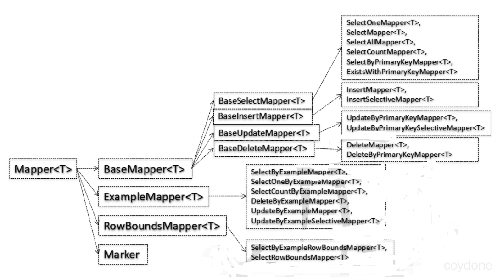
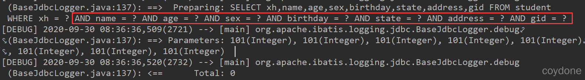
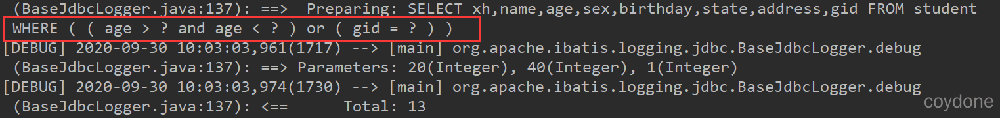
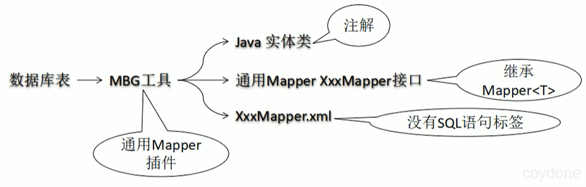
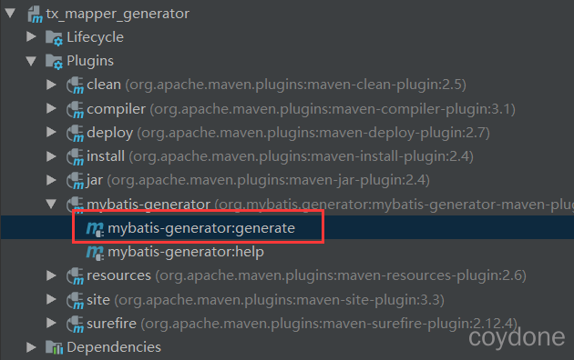

# Spring中使用通用Mapper - coydone - 博客园

## 搭建Spring整合Mybatis环境

1、创建项目

创建一个Maven工程即可，我们不需要整合SpringMVC，所以不需要web工程。

2、导入依赖

在pom.xml中导入Spring的相关依赖、Mybatis、数据库依赖、以及通用Mapper。

```xml
<dependencies>
    <dependency>
        <groupId>org.mybatis</groupId>
        <artifactId>mybatis</artifactId>
        <version>3.5.5</version>
    </dependency>
    <dependency>
        <groupId>org.mybatis</groupId>
        <artifactId>mybatis-spring</artifactId>
        <version>1.3.2</version>
    </dependency>
    <dependency>
        <groupId>org.springframework</groupId>
        <artifactId>spring-context</artifactId>
        <version>5.2.8.RELEASE</version>
    </dependency>
    <dependency>
        <groupId>org.springframework</groupId>
        <artifactId>spring-tx</artifactId>
        <version>5.2.8.RELEASE</version>
    </dependency>
    <dependency>
        <groupId>org.springframework</groupId>
        <artifactId>spring-jdbc</artifactId>
        <version>5.2.8.RELEASE</version>
    </dependency>
    <dependency>
        <groupId>org.aspectj</groupId>
        <artifactId>aspectjweaver</artifactId>
        <version>1.9.5</version>
    </dependency>

    <dependency>
        <groupId>mysql</groupId>
        <artifactId>mysql-connector-java</artifactId>
        <version>5.1.47</version>
    </dependency>

    <!-- 通用mapper -->
    <dependency>
        <groupId>tk.mybatis</groupId>
        <artifactId>mapper</artifactId>
        <version>4.1.5</version>
    </dependency>

    <!-- log4j日志 -->
    <dependency>
        <groupId>log4j</groupId>
        <artifactId>log4j</artifactId>
        <version>1.2.17</version>
    </dependency>
    <dependency>
        <groupId>org.slf4j</groupId>
        <artifactId>slf4j-log4j12</artifactId>
        <version>1.6.6</version>
    </dependency>
    <dependency>
        <groupId>org.slf4j</groupId>
        <artifactId>slf4j-api</artifactId>
        <version>1.7.30</version>
    </dependency>

    <!--c3p0连接池-->
    <dependency>
        <groupId>com.mchange</groupId>
        <artifactId>c3p0</artifactId>
        <version>0.9.5.2</version>
    </dependency>

    <!--junit单元测试-->
    <dependency>
        <groupId>junit</groupId>
        <artifactId>junit</artifactId>
        <version>4.12</version>
    </dependency>
</dependencies>
```

3、配置Spring整合Mybatis环境

*   配置mysql连接信息`jdbc.properties`。

```properties
jdbc.user=root
jdbc.password=root123
jdbc.url=jdbc:mysql://localhost:3306/k0503db?useUnicode=true&characterEncoding=utf8
jdbc.driver=com.mysql.jdbc.Driver
```

*   创建Mybatis的配置文件`mybatis-config.xml`

```xml
<?xml version="1.0" encoding="UTF-8"?>
<!DOCTYPE configuration PUBLIC "-//mybatis.org//DTD Config 3.0//EN" "http://mybatis.org/dtd/mybatis-3-config.dtd">
<configuration>

</configuration>
```

*   创建Spring的配置文件`applicationContext.xml`，整合Mybatis，配置声明式事务等。

```xml
<?xml version="1.0" encoding="UTF-8"?>
<beans xmlns="http://www.springframework.org/schema/beans"
	xmlns:xsi="http://www.w3.org/2001/XMLSchema-instance"
	xmlns:aop="http://www.springframework.org/schema/aop"
	xmlns:context="http://www.springframework.org/schema/context"
	xmlns:tx="http://www.springframework.org/schema/tx"
	xsi:schemaLocation="http://www.springframework.org/schema/beans http://www.springframework.org/schema/beans/spring-beans.xsd
		http://www.springframework.org/schema/context http://www.springframework.org/schema/context/spring-context-4.3.xsd
		http://www.springframework.org/schema/aop http://www.springframework.org/schema/aop/spring-aop-4.3.xsd
		http://www.springframework.org/schema/tx http://www.springframework.org/schema/tx/spring-tx-4.3.xsd">
	
	<!-- 配置数据源 -->
	<context:property-placeholder location="classpath:jdbc.properties"/>

	<bean id="dataSource" class="com.mchange.v2.c3p0.ComboPooledDataSource">
		<property name="user" value="${jdbc.user}"/>
		<property name="password" value="${jdbc.password}"/>
		<property name="jdbcUrl" value="${jdbc.url}"/>
		<property name="driverClass" value="${jdbc.driver}"/>
	</bean>

	<!-- 整合MyBatis -->
	<bean id="sqlSessionFactoryBean" class="org.mybatis.spring.SqlSessionFactoryBean">
		<property name="configLocation" value="classpath:mybatis-config.xml"/>
		<property name="dataSource" ref="dataSource"/>
	</bean>
	
	<!-- 整合通用Mapper所需要做的配置修改： -->
	<!-- 原始全类名：org.mybatis.spring.mapper.MapperScannerConfigurer -->
	<!-- 通用Mapper使用：tk.mybatis.spring.mapper.MapperScannerConfigurer -->
	<bean class="org.mybatis.spring.mapper.MapperScannerConfigurer">
		<property name="basePackage" value="com.coydone.mapper"/>
	</bean>

	<!-- 配置Service自动扫描的包 -->
	<context:component-scan base-package="com.coydone.service"/>

	<!-- 配置声明式事务 -->
	<bean id="dataSourceTransactionManager" class="org.springframework.jdbc.datasource.DataSourceTransactionManager">
		<property name="dataSource" ref="dataSource"/>
	</bean>

	<aop:config>
		<aop:advisor advice-ref="txAdvice" pointcut="execution(* *..*Service.*(..))"/>
	</aop:config>

	<tx:advice id="txAdvice" transaction-manager="dataSourceTransactionManager">
		<tx:attributes>
			<tx:method name="get*" read-only="true"/>
			<tx:method name="add*" rollback-for="java.lang.Exception" propagation="REQUIRES_NEW"/>
			<tx:method name="delete*" rollback-for="java.lang.Exception" propagation="REQUIRES_NEW"/>
			<tx:method name="update*" rollback-for="java.lang.Exception" propagation="REQUIRES_NEW"/>
		</tx:attributes>
	</tx:advice>
</beans>
```

4、配置log4j日志

由于我们要查看sql语句的执行，所以我们可以配置log4j的控制台日志输出，方便我们跟踪sql。

*   在pom文件中导入log4j的依赖。
*   在resources下创建log4j.properties文件。

```properties
log4j.rootLogger=DEBUG,myConsole
log4j.appender.myConsole=org.apache.log4j.ConsoleAppender
log4j.appender.myConsole.ImmediateFlush=true
log4j.appender.myConsole.Target=System.out
log4j.appender.myConsole.layout=org.apache.log4j.PatternLayout
log4j.appender.myConsole.layout.ConversionPattern=[%-5p] %d(%r) --> [%t] %l: %m %x %n

log4j.logger.com.mchange.v2=ERROR
```

5、测试整合环境

```java
package com.coydone.test;

import org.junit.Test;
import org.springframework.context.ApplicationContext;
import org.springframework.context.support.ClassPathXmlApplicationContext;

import javax.sql.DataSource;
import java.sql.Connection;
import java.sql.SQLException;

public class MapperTest {
    private ApplicationContext ac = new ClassPathXmlApplicationContext("applicationContext.xml");
    @Test
    public void test() throws SQLException {
        DataSource dataSource = ac.getBean(DataSource.class);
        Connection connection = dataSource.getConnection();
        System.out.println(connection);
    }
}
```

## 通用Mapper介绍

官方代码地址：[https://gitee.com/free](https://gitee.com/free)

官方文档：[https://gitee.com/free/Mapper/wikis/pages?sort\_id=208199&doc\_id=10514](https://gitee.com/free/Mapper/wikis/pages?sort_id=208199&doc_id=10514)

我们使用通用Mapper后，在mapper中我们对于单表的CRUD无需在xml配置文件中进行编写。虽然MBG可以自动生成xml文件，但是MBG生成的xml比较混乱，不利于代码的维护。使用通用Mapper后，只需实现通用Mapper的接口，就可以使用它内置的对单表的CRUD方法。

## 配置通用Mapper

*   在pom文件中导入通用mapper的依赖。
*   在Spring的配置文件中将mapper配置扫描的信息`org.mybatis.spring.mapper.MapperScannerConfigurer`中的`org`改为`tk`。

```xml
<!-- 整合通用Mapper所需要做的配置修改： -->
<!-- 原始全类名：org.mybatis.spring.mapper.MapperScannerConfigurer -->
<!-- 通用Mapper使用：tk.mybatis.spring.mapper.MapperScannerConfigurer -->
<bean class="tk.mybatis.spring.mapper.MapperScannerConfigurer">
    <property name="basePackage" value="com.coydone.mapper"/>
</bean>
```

## 使用通用Mapper

1、创建与数据库表对应的实体类。

考虑到基本数据类型在 Java 类中都有默认值，会导致 MyBatis 在执行相关操作 时很难判断当前字段是否为 null，所以在 MyBatis 环境下使用 Java 实体类时尽量不要使用基本数据类型，都使用对应的包装类型。

```java
public class Student implements Serializable {
    private Integer xh;
    private String name;
    private Integer age;
    private String sex;
    private Date birthday;
    private Integer state;
    private String address;
    private Integer gid;//年级编号
    //省略getter()、setter()、无参构造、有参构造、toString()方法
}
```

2、编写实体类对应的mapper接口，只需继承通用Mapper的Mapper接口即可。

[](https://oss.coydone.com/md/ssm/20201001021012.png/change01)

通用Mapper的接口结构

```java
/**
 * 具体操作数据库的mapper接口，它需要继承通用mapper的Mapper<T>的接口。
 * T表示我们操作数据库实体的类型
 */
public interface StudentMapper extends Mapper<Student> {
}
```

3、编写service层及其实现。

```java
public interface StudentService {
    Student getOne(Student student);
}
@Service
public class StudentServiceImpl implements StudentService {
    @Autowired
    private StudentMapper studentMapper;

    @Override
    public Student getOne(Student student) {
        return studentMapper.selectOne(student);
    }
}
```

4、在测试类中测试通用Mapper提供的基本方法。

```java
public class StudentMapperTest {
    private ApplicationContext ac = new ClassPathXmlApplicationContext("applicationContext.xml");
    private StudentService studentService = ac.getBean(StudentService.class);
    @Test
    public void testSelectOne() {
        //1.创建封装查询条件的实体类对象
        Student student = new Student(null,"亚索",23,null,null,null,null,null);
        //2.执行查询
        Student student1 = studentService.getOne(student);
        //3.打印
        System.out.println(student1);
    }
}
```

## 常用注解

### @Table

作用：建立实体类和数据库表之间的对应关系。

默认规则：实体类类名首字母小写作为表名。Student类→student表。

用法：在@Table 注解的 name 属性中指定目标数据库表的表名。

```java
@Table(name = "student")
public class Student implements Serializable {}
```

### @Column

作用：建立实体类字段和数据库表字段之间的对应关系。

默认规则： 实体类字段：驼峰式命名；数据库表字段：使用“\_”区分各个单词。

用法：在@Column 注解的 name 属性中指定目标字段的字段名 。

```java
@Column(name = "birthday")
private Date birthday;
```

### @Id

通用 Mapper 在执行`xxxByPrimaryKey(key)`方法时，有两种情况。

情况 1：没有使用@Id注解明确指定主键字段。

[](https://oss.coydone.com/md/ssm/20201001021021.png/change01)

之所以会生成上面这样的WHERE子句是因为通用Mapper将实体类中的所有字段都拿来放在一起作为联合主键。

情况 2：使用@Id 主键明确标记和数据库表中主键字段对应的实体类字段。

```java
@Id
private Integer xh;
```

### @GeneratedValue

作用：让通用 Mapper 在执行 insert 操作之后将数据库自动生成的主键值回写到实体类对象中。

自增主键用法：（MySQL数据库）

```java
@Id
@GeneratedValue(strategy = GenerationType.IDENTITY)
private Integer xh;
```

序列主键用法：（Oracle数据库）

```java
@Id
@GeneratedValue(
    strategy = GenerationType.IDENTITY,
    generator = "select SEQ_ID.nextval from dual")
private Integer id;
```

### @Transient

一般情况下，实体中的字段和数据库表中的字段是一一对应的，但是也有很多情况我们会在实体中增加一些额外的属性，这种情况下，就需要使用 `@Transient` 注解来告诉通用 Mapper 这不是表中的字段。

默认情况下，只有简单类型（基本类型的包装类）会被自动认为是表中的字段（可以通过配置中的`useSimpleType`控制）。

## 常用方法

1、selectOne()

使用非空的值生成 WHERE 子句，在条件表达式中使用“=”进行比较，要求必须返回一个实体类结果，如果有多个，则会抛出异常。

2、xxxByPrimaryKey()

需要使用`@Id`主键明确标记和数据库表主键字段对应的实体类字段，否则通用 Mapper 会将所有实体类字段作为联合主键。

3、xxxSelective()

非主键字段如果为 null 值，则不加入到 SQL 语句中。

## QBC查询

QBC是Query By Criteria 的简称，Criteria 是 Criterion 的复数形式。意思是：规则、标准、准则。在 SQL 语句中相当于查询条件。 QBC 查询是将查询条件通过 Java 对象进行模块化封装。

示例：

```java
@Test
public void testSelectByExample() {
    //目标：WHERE (age > ? AND age< ? ) OR (gid = 1)
    //1.创建 Example 对象
    Example example = new Example(Student.class);

    // i.设置排序信息
    //example.orderBy("xh").asc().orderBy("age").desc();
    //ii.设置“去重”
    //example.setDistinct(true);
    //iii.设置 select 字段
    //example.selectProperties("name","age");

    //2.通过 Example 对象创建 Criteria 对象
    Example.Criteria criteria01 = example.createCriteria();
    Example.Criteria criteria02 = example.createCriteria();

    //3.在两个 Criteria 对象中分别设置查询条件
    // property 参数：实体类的属性名
    // value 参数：实体类的属性值
    criteria01.andGreaterThan("age", 20).andLessThan("age", 40);
    criteria02.andEqualTo("gid", 1);

    //4.使用 OR 关键词组装两个 Criteria 对象
    example.or(criteria02);

    //5.执行查询
    List<Student> students = studentService.selectByExample(example);
    for (Student student : students) {
        System.out.println(student);
    }
}
```

通用Mapper帮我们生成的SQL：

[](https://oss.coydone.com/md/ssm/20201001021043.png/change01)

## 逆向工程

通用Mapper逆向工程在码云上的官方文档：[https://gitee.com/free/Mapper/wikis/pages?sort\_id=236560&doc\_id=10514](https://gitee.com/free/Mapper/wikis/pages?sort_id=236560&doc_id=10514)

[](https://oss.coydone.com/md/ssm/20201001021047.png/change01)

MBG流程

1、在pom文件中配置依赖和插件

```xml
<dependencies>
    <dependency>
        <groupId>tk.mybatis</groupId>
        <artifactId>mapper</artifactId>
        <version>4.1.5</version>
    </dependency>
    <dependency>
        <groupId>org.mybatis</groupId>
        <artifactId>mybatis</artifactId>
        <version>3.5.5</version>
    </dependency>
</dependencies>

<build>
    <plugins>
        <plugin>
            <artifactId>maven-compiler-plugin</artifactId>
            <configuration>
                <source>1.8</source>
                <target>1.8</target>
            </configuration>
        </plugin>
        <plugin>
            <groupId>org.mybatis.generator</groupId>
            <artifactId>mybatis-generator-maven-plugin</artifactId>
            <version>1.3.6</version>
            <configuration>
                <configurationFile>
                    ${basedir}/src/main/resources/generator/generatorConfig.xml
                </configurationFile>
                <overwrite>true</overwrite>
                <verbose>true</verbose>
            </configuration>
            <dependencies>
                <dependency>
                    <groupId>mysql</groupId>
                    <artifactId>mysql-connector-java</artifactId>
                    <version>5.1.47</version>
                </dependency>
                <dependency>
                    <groupId>tk.mybatis</groupId>
                    <artifactId>mapper</artifactId>
                    <version>4.1.5</version>
                </dependency>
            </dependencies>
        </plugin>
    </plugins>
</build>
```

2、在resources/generator下创建MGB的配置文件：`generatorConfig.xml`。

```xml
<!DOCTYPE generatorConfiguration
        PUBLIC "-//mybatis.org//DTD MyBatis Generator Configuration 1.0//EN"
        "http://mybatis.org/dtd/mybatis-generator-config_1_0.dtd">

<generatorConfiguration>
    <!-- 引入外部属性文件 -->
    <properties resource="config.properties"/>

    <context id="Mysql" targetRuntime="MyBatis3Simple" defaultModelType="flat">
        <property name="beginningDelimiter" value="`"/>
        <property name="endingDelimiter" value="`"/>

        <!-- 配置通用mapperMBG相关信息 -->
        <plugin type="tk.mybatis.mapper.generator.MapperPlugin">
            <property name="mappers" value="tk.mybatis.mapper.common.Mapper"/>
            <property name="caseSensitive" value="true"/>
        </plugin>

        <jdbcConnection driverClass="${jdbc.driverClass}"
                        connectionURL="${jdbc.url}"
                        userId="${jdbc.user}"
                        password="${jdbc.password}">
        </jdbcConnection>

        <!--实体类存放位置-->
        <javaModelGenerator targetPackage="com.coydone.entity"
                            targetProject="src/main/java"/>

        <!--mapper.xml文件存放位置-->
        <sqlMapGenerator targetPackage="mapper"
                         targetProject="src/main/resources"/>

        <!--mapper接口存放位置-->
        <javaClientGenerator targetPackage="com.coydone.mapper"
                             targetProject="src/main/java"
                             type="XMLMAPPER"/>

        <!-- 根据数据库表生成Java文件的相关规则 -->
        <!-- tableName="%"表示数据库中所有表都参与逆向工程，此时使用默认规则 -->
        <!-- 默认规则：table_dept→TableDept -->
        <!-- 不符合默认规则时需要使用tableName和domainObjectName两个属性明确指定 -->
        <table tableName="student" domainObjectName="Student">
            <!-- 配置主键生成策略 -->
            <generatedKey column="xh" sqlStatement="Mysql" identity="true" />
        </table>
        <table tableName="grade" domainObjectName="Grade">
            <generatedKey column="gid" sqlStatement="Mysql" identity="true" />
        </table>
    </context>
</generatorConfiguration>
```

3、配置MBG配置文件中依赖的数据库连接信息配置：`config.properties`。

```properties
# 数据库连接信息
jdbc.driverClass = com.mysql.jdbc.Driver
jdbc.url = jdbc:mysql://localhost:3306/k0503db
jdbc.user = root
jdbc.password = root123

#c3p0
jdbc.maxPoolSize=50
jdbc.minPoolSize=10
jdbc.maxStatements=100
jdbc.testConnection=true

# mapper
mapper.plugin = tk.mybatis.mapper.generator.MapperPlugin
mapper.Mapper = tk.mybatis.mapper.common.Mapper
```

4、在Maven中运行MBG插件。

[](https://oss.coydone.com/md/ssm/20201001021056.png/change01)

5、测试

```java
public static void main(String[] args) {
    SqlSessionFactoryBuilder builder = new SqlSessionFactoryBuilder();
    InputStream inputStream = MBGTest.class.getClassLoader().getResourceAsStream("mybatis-config.xml");
    SqlSessionFactory sqlSessionFactory = builder.build(inputStream);
    SqlSession sqlSession = sqlSessionFactory.openSession();
    
    //安照java的方式整合通用mapper
    //创建MapperHelper对象
    MapperHelper mapperHelper = new MapperHelper();
    //通过MapperHelper对象对原生的Mybatis的Configuration对象进行处理
    Configuration configuration = sqlSession.getConfiguration();
    mapperHelper.processConfiguration(configuration);

    StudentMapper studentMapper = sqlSession.getMapper(StudentMapper.class);
    List<Student> students = studentMapper.selectAll();
    for (Student student : students) {
        System.out.println(student);
    }
}
```

## 二级缓存

1、在mybatis的配置文件中配置开启二级缓存。

```xml
<!--开启二级缓存-->
<settings>
    <setting name="cacheEnabled" value="true"/>
</settings>
```

2、在 XxxMapper接口上使用`@CacheNamespace`注解。

```java
@CacheNamespace
public interface StudentMapper extends Mapper<Student> {
}
```

3、XxxMapper接口对应的实体类支持序列化。即实现`Serializable`接口。

```java
public class Student implements Serializable {}
```